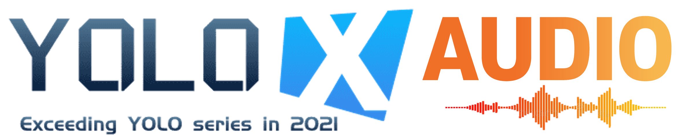
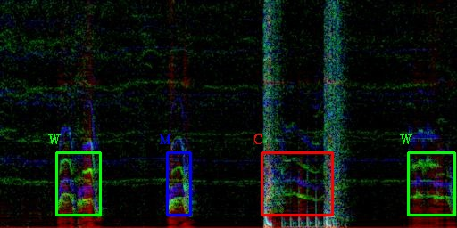

<div align="center"></div>
<div align="center"></div>

## Introduction
YOLOX_AUDIO is an audio event detection model based on YOLOX, an anchor-free version of YOLO.
This repo is an implementated by PyTorch.
Main goal of YOLOX_AUDIO is to detect and classify pre-defined audio events in multi-spectrogram domain using image object detection frameworks. 


## Updates!!
* 【2021/11/15】 We released YOLOX_AUDIO to public 

## Quick Start

<details>
<summary>Installation</summary>

Step1. Install YOLOX_AUDIO.
```shell
git clone https://github.com/intflow/YOLOX_AUDIO.git
cd YOLOX_AUDIO
pip3 install -U pip && pip3 install -r requirements.txt
pip3 install -v -e .  # or  python3 setup.py develop
```

Step2. Install [pycocotools](https://github.com/cocodataset/cocoapi).

```shell
pip3 install cython; pip3 install 'git+https://github.com/cocodataset/cocoapi.git#subdirectory=PythonAPI'
```

</details>

<details>
<summary>Data Preparation</summary>

Step1. Prepare audio wavform files for training.
AUDIO_DATAPATH/wav

Step2. Write audio annotation files for training.
AUDIO_DATAPATH/label.json

```shell
{
    "00000.wav": {
        "speaker": [
            "W",
            "M",
            "C",
            "W"
        ],
        "on_offset": [
            [
                1.34425,
                2.4083125
            ],
            [
                4.0082708333333334,
                4.5560625
            ],
            [
                6.2560416666666665,
                7.956104166666666
            ],
            [
                9.756083333333333,
                10.876624999999999
            ]
        ]
    },
    "00001.wav": {
        "speaker": [
            "W",
            "M",
            "C",
            "M",
            "W",
            "C"
        ],
        "on_offset": [
            [
                1.4325416666666666,
                2.7918958333333332
            ],
            [
                2.1762916666666667,
                4.109729166666667
            ],
            [
                7.109708333333334,
                8.530916666666666
            ],
            [
                8.514125,
                9.306104166666668
            ],
            [
                12.606083333333334,
                14.3345625
            ],
            [
                14.148958333333333,
                15.362958333333333
            ]
        ]
    },
    ...
}
```

Step3. Convert audio files into spectrogram images.

```shell
python tools/json_gen_audio2coco.py
```

Please change the dataset path and file names for your needs
```
root = '/data/AIGC_3rd_2021/GIST_tr2_veryhard5000_all_tr2'
os.system('rm -rf '+root+'/img/')
os.system('mkdir '+root+'/img/')
wav_folder_path = os.path.join(root, 'wav')
img_folder_path = os.path.join(root, 'img')
train_label_path = os.path.join(root, 'tr2_devel_5000.json')
train_label_merge_out = os.path.join(root, 'label_coco_bbox.json')
```

</details>

<details>
<summary>Training</summary>

Step1. Change Data loading path of exps/yolox_audio__tr2/yolox_x.py
```shell
        self.train_path = '/data/AIGC_3rd_2021/GIST_tr2_veryhard5000_all_tr2'
        self.val_path = '/data/AIGC_3rd_2021/tr2_set_01_tune'
        self.train_ann = "label_coco_bbox.json"
        self.val_ann = "label_coco_bbox.json"
```

Step2. Begin training:

```shell
python3 tools/train.py -expn yolox_audio__tr2 -n yolox_audio_x \
-f exps/yolox_audio__tr2/yolox_x.py -d 4 -b 32 --fp16 \
-c /data/pretrained/yolox_x.pth

```
* -d: number of gpu devices
* -b: total batch size, the recommended number for -b is num-gpu * 8
* -f: path of experiement file
* --fp16: mixed precision training
* --cache: caching imgs into RAM to accelarate training, which need large system RAM. 

We are encouraged to use pretrained YOLOX model for the training.
https://github.com/Megvii-BaseDetection/YOLOX

</details>


<details>
<summary>Inference</summary>
Run following demo_audio.py

```shell
python3 tools/demo_audio.py --demo wav -expn yolox_audio__tr2 -n yolox_audio_x \
-f exps/yolox_audio__tr2/yolox_x.py \
-c /data/pretrained/yolox_x__AGC21_tr2.pth \
--path ./assets/test.wav \
--conf 0.2 --nms 0.65 --tsize_h 256 --tsize_w 512 --save_result --device gpu
```

From the demo_audio.py you can get on-offset VAD time and class of each audio chunk.
</details>


## References
* YOLOX baseline implemented by PyTorch: [YOLOX](https://github.com/Megvii-BaseDetection/YOLOX)
```
 @article{yolox2021,
  title={YOLOX: Exceeding YOLO Series in 2021},
  author={Ge, Zheng and Liu, Songtao and Wang, Feng and Li, Zeming and Sun, Jian},
  journal={arXiv preprint arXiv:2107.08430},
  year={2021}
}
```
* Librosa for audio feature extraction: [librosa](https://librosa.org/doc/main/)
```
McFee, Brian, Colin Raffel, Dawen Liang, Daniel PW Ellis, Matt McVicar, Eric Battenberg, and Oriol Nieto. “librosa: Audio and music signal analysis in python.” In Proceedings of the 14th python in science conference, pp. 18-25. 2015.
```

## Acknowledgement
This work was supported by the Institute of Information & communications Technology Planning & Evaluation (IITP) grant funded by the Korea government (MSIT) (No. 2021-0-00014).
